## 汇编语言-王爽
[toc]

### 第一章 基础知识
#### 1.1 机器语言
简单介绍了早期在纸带上撰写的由0和1组成的机器码
#### 1.2 汇编语言的诞生
汇编指令乃是汇编语言的主体，亦是机器指令便于记忆的书写格式(助记符)  
汇编指令与机器指令一一对应
#### 1.3 汇编语言的组成
其由以下三类指令组成
- 汇编指令 机器码的助记符，有对应的机器码
- 伪指令 无对应的机器码，由编译器执行，计算机并不执行
- 其他符号 如+,-,*,/等，由编译器识别，没有对应的机器码

#### 1.4 存储器
介绍了磁盘与内存

#### 1.5 指令与数据
指令与数据乃应用上的概念，在内存或磁盘上，指令和数据没有任何区别，都是二进制信息

#### 1.6 存储单元
存储器一般会被划分为若干个存储单元  
微型机存储器的一个单元可以存储一个字节

#### 1.7 cpu对存储器的读写

在计算机中，有专门连接Cpu和其他芯片的导线，通常称为总线。  
总线从物理上来讲，就是一根根导线的集合  
总线根据位置分类,有：

- 片内总线（芯片内部总线）

- 系统总线（计算机各部件之间的信息传输线）

根据传送信息的不同，系统总线从逻辑上又分为:地址总线、控制总线和数据总线。

CPU要想进行数据的读写，必须和外部器件（标准的说法是芯片）进行以下3类信息的交互:

- 存储单元的地址,即地址信息
- 器件的选择，读或写的命令,即控制信息
- 读或写的数据，即数据信息

#### 1.8 地址总线
CPU通过地址总线来指定存储单元  
可见地址总线上能传输多少个不同的信息，cpu就可以对多少个存储单元进行寻址  
一个cpu有n根地址线，则可以说这个cpu的地址总线的宽度为n。这样的cpu最多可以寻找2^n个内存单元

#### 1.9 数据总线
CPU与内存或其他器件之间的数据传送是通过数据总线来进行的  
数据总线的宽度决定了cpu和外界的数据传输速度

#### 1.10 控制总线
CPU对外部器件的控制是通过控制总线来进行的。  
有多少根控制总线，就意味着CPU提供了对外部器件的多少种控制。  
所以，控制总线的宽度决定了CPU对外部器件的控制能力。

#### check point 1.1

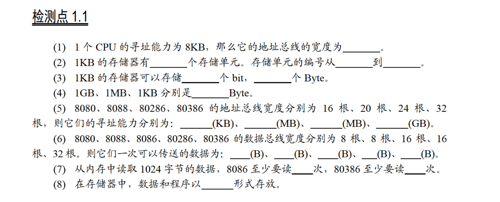

- 宽度13
- 1024个存储单元，从0-1023
- 8192个bit,1024个byte
- 2^30,2^20,2^10
- 64KB,1MB,16MB,4GB
- 1,1,2,2,4
- 512次，256次
- 二进制形式

#### 1.11 内存地址空间
所有可寻到的内存单元(一般为2^n个)便构成了这个cpu的内存地址空间

#### 1.12 主板
主板上有核心器件和一些主要器件，这些器件通过总线（地址总线、数据总线、控制总线）相连。这些器件有**CPU、存储器、外围芯片组、扩展插槽等**。扩展插槽上一般插有RAM内存条和各类接口卡。

#### 1.13 接口卡
CPU对外设都不能直接控制，如显示器、音箱、打印机等。

直接控制这些设备进行工作的是插在扩展插槽上的接口卡。

扩展插槽通过总线和CPU相连，所以接口卡也通过总线同CPU相连。CPU可以直接控制这些接口卡，从而实现CPU对外设的间接控制。

如：CPU无法直接控制显示器，但CPU可以直接控制显卡，从而实现对显示器的间接控制

#### 1.14 各类存储器芯片
从读写属性上分析，则存储器芯片可分为:
- 随机存储器（RAM）在程序的执行过程中可读可写，必须带电存储
- 只读存储器（ROM）在程序的执行过程中只读，关机数据不丢失  

从功能和连接上则可分为:
- 随机存储器，用于存放供cpu使用的绝大多数程序和数据
- 装有bios的rom
- 接口卡上的ram,如显存

#### 1.15 内存地址空间
上面的这些存储器，虽然在物理上是独立的器件，但是在以下两点上相同:
- 都和cpu的总线相连
- cpu对他们进行读写时都通过控制线发出内存读写命令

也就是说，cpu在操控他们的时候，把他们都当作内存来看待。其将系统中各类存储器看作一个逻辑存储器，这个逻辑存储器就是我们所说的内存地址空间。 

对于CPU，所有存储器中的存储单元被看作一个由若干存储单元组成的逻辑编辑器，它的容量受CPU寻址能力限制。

每个物理存储器在这个逻辑存储器中都占有一个地址段，即一段地址空间。CPU在这段地址空间中读写数据，实际上就是在相对应的物理存储器中读写数据（对ROM写无效）。

### 第二章 寄存器

#### 2.1 通用寄存器

通用寄存器：通常用来存放一般性的数据，有AX、BX、CX、DX，它们可分为两个可独立使用的8位寄存器，

| 16位 | 高8位 | 低8位 |
| ---- | ----- | ----- |
| ax   | ah    | al    |
| bx   | bh    | bl    |
| cx   | ch    | cl    |
| dx   | dh    | dl    |

#### 2.2 字在寄存器中的存储
字：记为word，一个字由两个字节组成，可以存在一个16位寄存器中(16位CPU)  

8086采用小端序：高地址存放高位字节，低地址存放低位字节

#### 2.3 几条汇编指令
简单介绍了add,mov  
注：若al=93h,执行 add al,c5h,进位的1并不会被保存在ah中  
cpu在执行这条指令的时候认为ah与al是两个毫无关联的寄存器

#### checkpoint 2.1
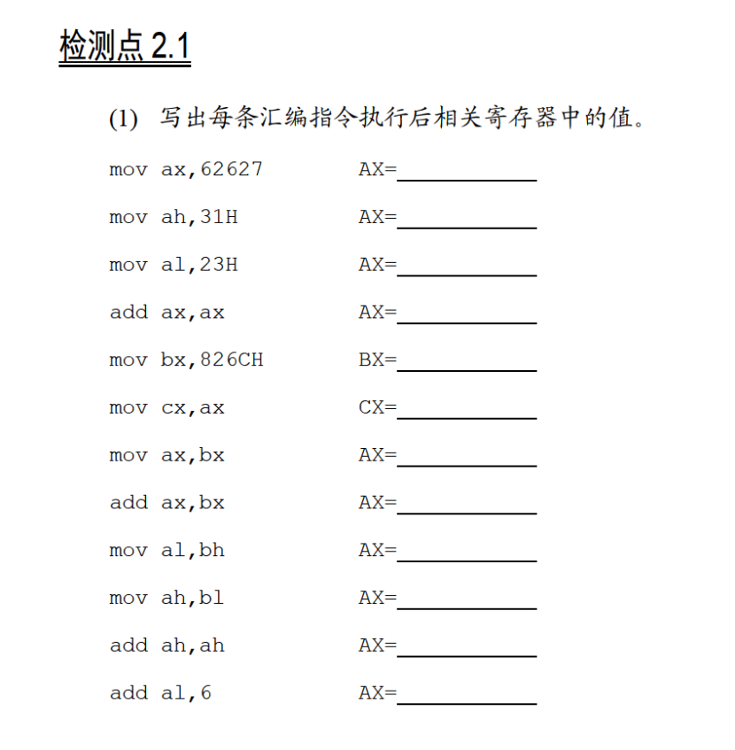
- ax=f4a3h
- ax=31a3h
- ax=3123h
- ax=6246h
- bx=826ch
- cx=6246h
- ax=826ch
- ax=04d8h
- ax=0482h
- ax=6c82h
- ax=d882h
- ax=d888h
 
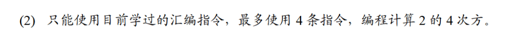

mov ax ,2
add ax,ax
add ax,ax
add ax,ax

#### 2.4 物理地址
每一个内存单元在内存空间中都有一个唯一的地址，这个地址便是物理地址  
cpu通过地址总线送入存储器的,必须是一个内存单元的物理地址

#### 2.5 16位结构的cpu

16位结构CPU具有下面几方面的结构特性。

- 运算器一次最多可以处理16位的数据；
- 寄存器的最大宽度为16位；
- 寄存器和运算器之间的通路为16位。

这意味这其能够一次性处理，传输，暂时存储的信息的最大长度是16位的。

#### 2.6 8086cpu给出物理地址的方法

8086CPU有20位地址总线，可以传送20位地址，达到1MB寻址能力。  
8086CPU又是16位结构，在内部一次性处理、传输、暂时存储的地址为16位。  
从8086CPU的内部结构来看，如果将地址从内部简单地发出，那么它只能送出16位的地址，表现出的寻址能力只有64KB。  
8086CPU采用一种在内部用两个16位地址合成的方法来形成一个20位的物理地址。  

当8086CPU要读写内存时：

CPU中的相关部件提供两个16位的地址，一个称为段地址，另一个称为偏移地址；  
地址加法器将两个16位地址合成为一个20位的物理地址；
地址加法器采用物理地址 = 段地址×16 + 偏移地址的方法用段地址和偏移地址合成物理地址。

#### 2.7 段地址*16+偏移地址=物理地址的本质含义

- 基础地址+偏移地址=物理地址
- 因16位限制，但又要达到20位的寻址能力所做的调整

#### 2.8 段的概念
我们可以将一段内存定义为一个段，用一个段地址指示段，用偏移地址访问段内的单元，从而用分段的方式来管理内存。

- 段地址*16必然是16的倍数
- 偏移地址为16位，故而其寻址能力为64kb，故一个段的最大长度为64kb

#### checkpoint 2.2
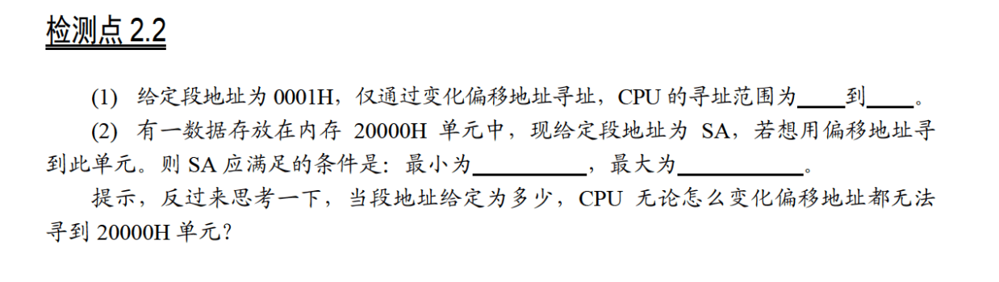

- (1) 00010h ~ 1000fh
- (2) min= 1001h, max=2000h
- sa<=1000h,>=2001h 
#### 2.9 段寄存器

段寄存器：8086CPU有4个段寄存器：CS、DS、SS、ES，提供内存单元的段地址。

#### 2.10 cs和ip

CS为代码段寄存器，IP为指令指针寄存器，

CPU将CS、IP中的内容当作指令的段地址和偏移地址,用它们合成指令的物理地址,

任意时刻，CPU将CS:IP指向的内容当作指令执行(即是PC)  

8086CPU的工作过程简要描述

- 从CS:IP指向的内存单元读取指令，读取的指令进入指令缓冲器；  
- IP=IP+所读取指令的长度，  
- 执行指令。转到步骤1，重复这个过程。  

在8086CPU加电启动或复位后（即CPU刚开始工作时）CS和IP被设置为CS=FFFFH，IP=0000H，即在8086PC机刚启动时，FFFF0H单元中的指令是8086PC机开机后执行的第一条指令。


#### 2.11 修改cs,ip的指令

mov 指令不能用于设置cs,ip的值(8086未提供)

8086CPU提供转移指令修改CS、IP的内容。

jmp 段地址:偏移地址：用指令中给出的段地址修改CS，偏移地址修改IP。如：jmp 2AE3:3

jmp 某一合法寄存器：仅修改IP的内容。如：jmp ax。在含义上好似：mov IP，ax

8086CPU不支持将数据直接送入段寄存器的操作，这属于8086CPU硬件设计
 
question 2.3
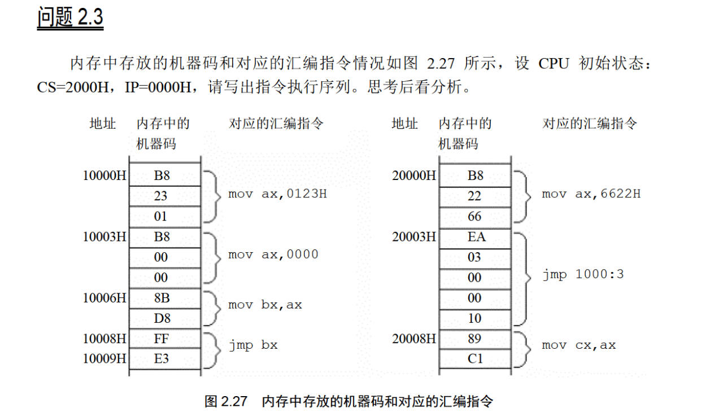

- mov ax,6622h
- jmp 1000:3
- mov ax,0000
- mov bx,ax
- jmp bx(0000)
- mov ax,0123h
- 转回到mov ax,0000(第三步)
#### 2.12 代码段

我们可以根据需要将一组内存单元定义为一个段(地址连续,起始地址为16的倍数的内存单元)

用一个段存放数据，将它定义为“数据段”

用一个段存放代码，将它定义为“代码段”

用一个段当作栈，将它定义为“栈段”

#### checkpoint 2.3


共4次，最后ip值为0

[实验1](../../../projects/assembly/assembly_language/expr_1/)

### 第三章 寄存器(内部访问)

#### 3.1 内存中字的存储

小端序

0-20h
1-4eh
2-12h
3-00h
4-null
5-null

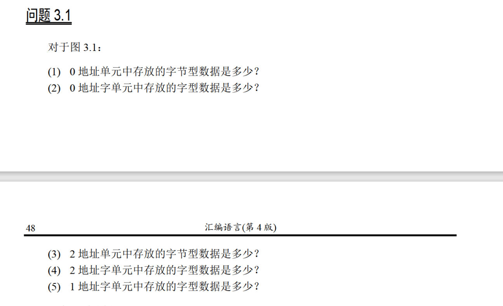

- 20h
- 4e20h
- 12h
- 0012h
- 124eh


#### 3.2 ds和[address]

DS寄存器：通常用来存放要访问数据的段地址

[address]表示一个偏移地址为address的内存单元，段地址默认放在ds中

通过数据段段地址和偏移地址即可定位内存单元。

8086不支持将数据直接送入(mov)段寄存器的做法

#### 3.3 字的传送

8086支持16位传输，故直接传输即可


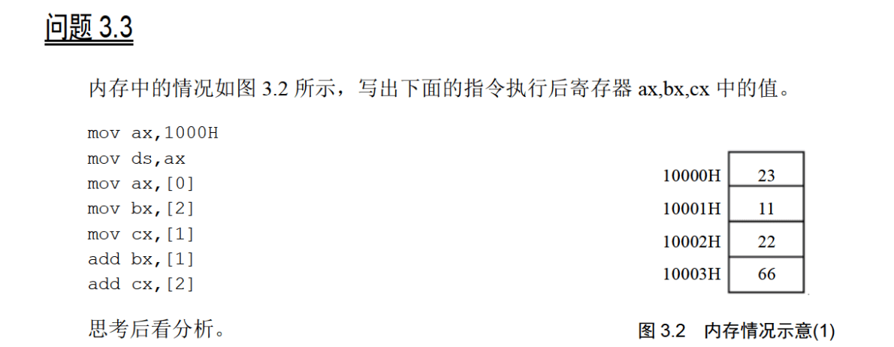

- ax 1000h
- ax 1123h
- bx 6622h
- cx 2211h
- bx 8833h
- cx 8833h

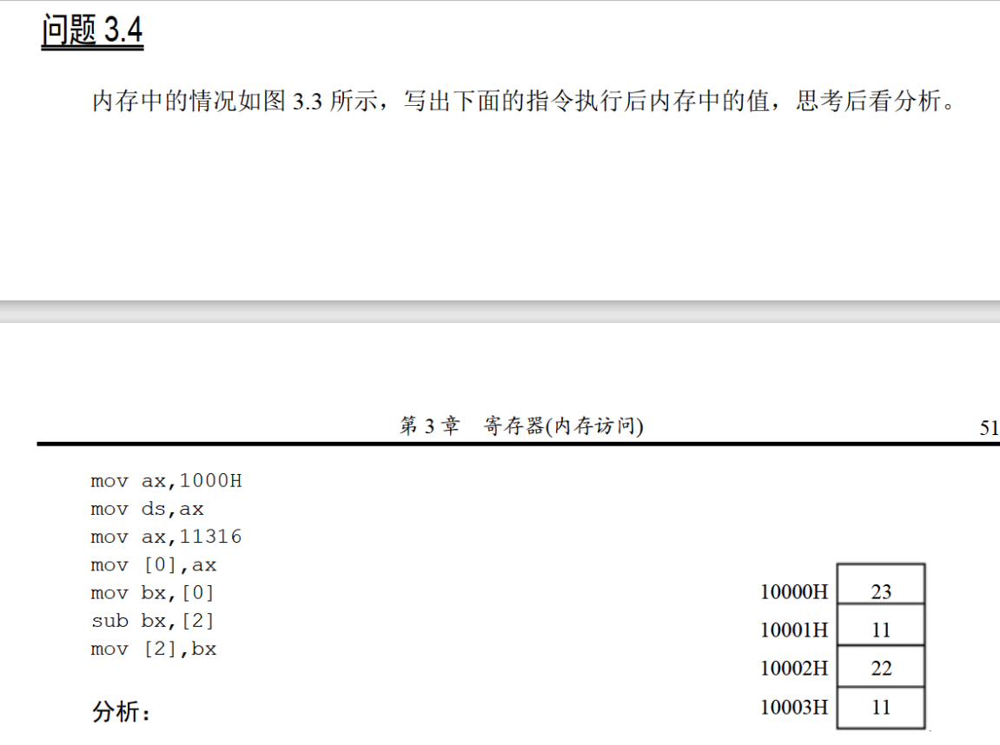

- 10000h 34
- 10001h 2c
- 10002h 12 
- 10003h 1b

#### 3.4 mov,add,sub指令

他们被允许的形式有：

mov 寄存器，(寄存器，数据，内存单元)
mov (内存单元，段寄存器) , 寄存器

add 寄存器，(寄存器，数据，内存单元)
add 内存单元 , 寄存器

sub 寄存器，(寄存器，数据，内存单元)
sub 内存单元 , 寄存器

#### 3.5 数据段
使用ds来指定数据段，使用[address]来控制段内偏移地址
直观上与内存单元有关
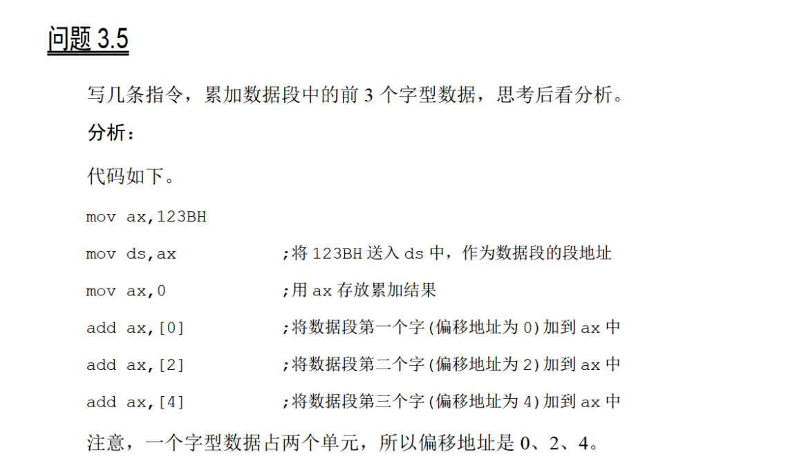

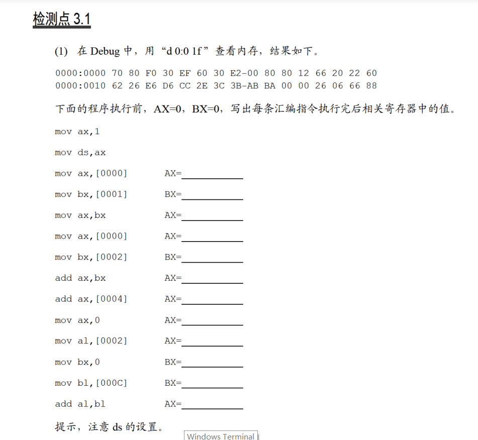
```
- ax 2662h
- bx e626h
- ax e626h
- ax 2662h
- bx d6e6h
- ax fd48h
- ax 2c14h
- ax 0000h
- ax 00e6h
- bx 0000h
- bx 0026h
- ax 000ch
```


(1)

- mov ax,6622h
- jmp 0ff0:0110
- mov ax,2000h
- mov ds,ax
- mov ax,[0002]

(2)
懒得写

(3)
最好将两者分开
用数据段和代码段


#### 3.6 栈
简单介绍了栈的概念(LIFO,last in first out)

#### 3.7 cpu提供的栈机制

在基于8086CPU编程的时候，可以将一段内存当作栈来使用。

栈段寄存器SS，存放段地址，SP寄存器存放偏移地址，任意时刻，SS:SP皆指向栈顶元素

8086CPU中，入栈时，**栈顶从高地址向低地址方向增长**

push ax表示将寄存器ax中的数据送入栈中，由两步完成。

- SP=SP-2，SS:SP指向当前栈顶前面的单元，以当前栈顶前面的单元为新的栈顶；
- 将ax中的内容送入SS:SP指向的内存单元处，SS:SP此时指向新栈顶。

pop ax表示从栈顶取出数据送入ax，由以下两步完成:

- 将SS:SP指向的内存单元处的数据送入ax中；
- SP=SP+2，SS:SP指向当前栈顶下面的单元，以当前栈顶下面的单元为新的栈顶。

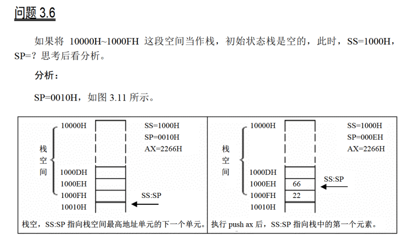

栈空时其指向栈最底部下面的单元，即10010h  
故sp=0010h

#### 3.8 栈顶超界的问题
pop,push皆有可能超出栈的空间，从而干扰外界的数据和代码，引发危险

#### 3.9 push,pop指令

push/pop 寄存器，段寄存器，内存单元都是可以的
故而两者可以配套在寄存器，段寄存器，内存单元间传输数据

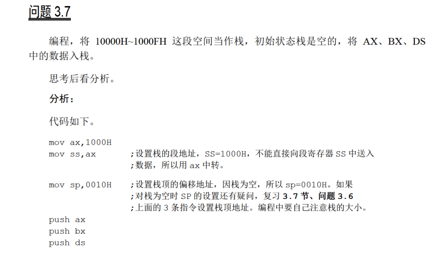

- 注意栈顶指针的设置 (ss:sp)

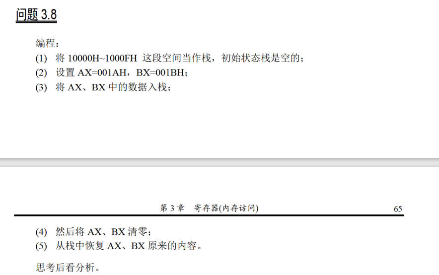

- mov ax , 1000h
- mov ss , ax
- mov sp , 0010h
- mov ax , 001ah
- mov bx , 001bh
- push ax
- push bx
- sub ax , ax
- sub bx , bx
- pop bx
- pop ax


 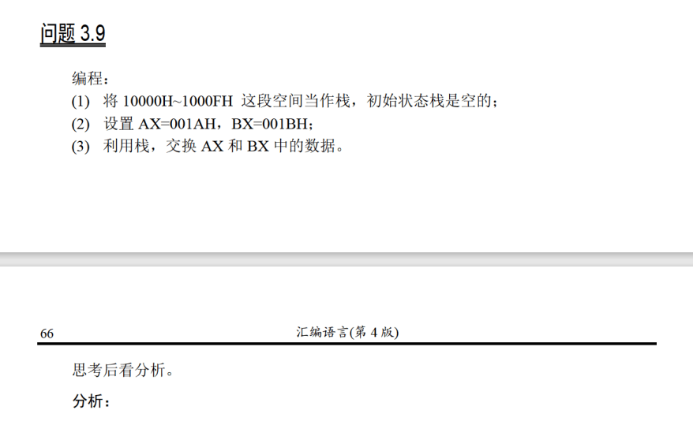

- mov ax , 1000h
- mov ss , ax
- mov sp , 0010h
- mov ax , 001ah
- mov bx , 001bh
- push ax
- push bx
- pop ax
- pop bx

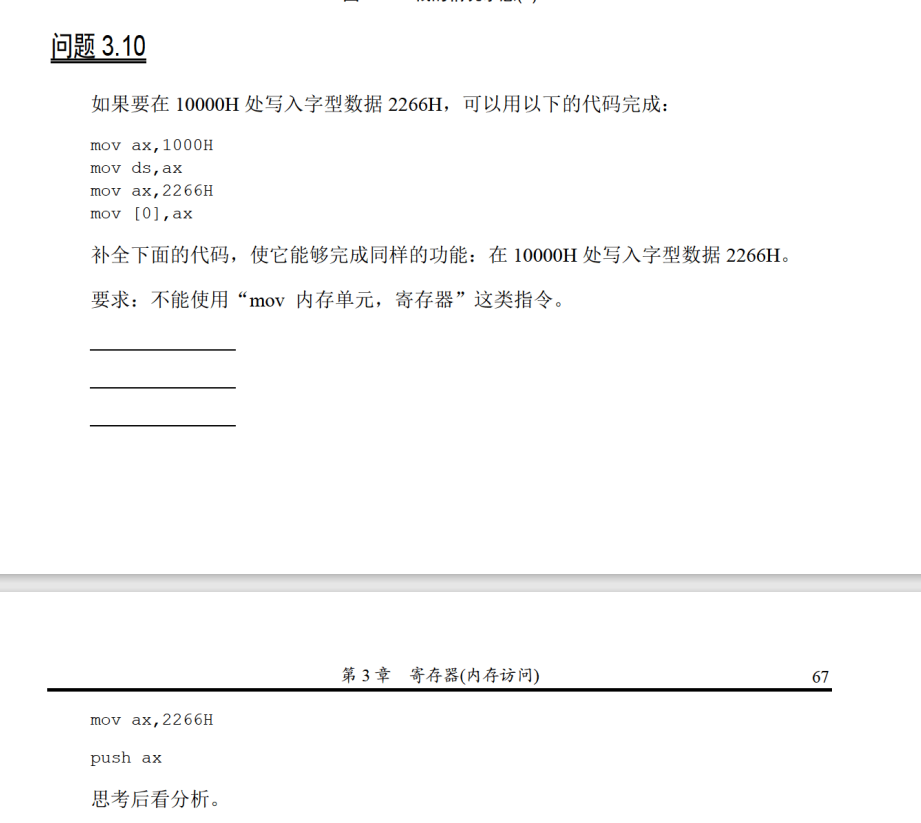

- mov ax , 1000h
- mov ss , ax
- mov sp , 0002h
 
#### 3.10 栈段
和以前的段一样
使用ss与sp控制

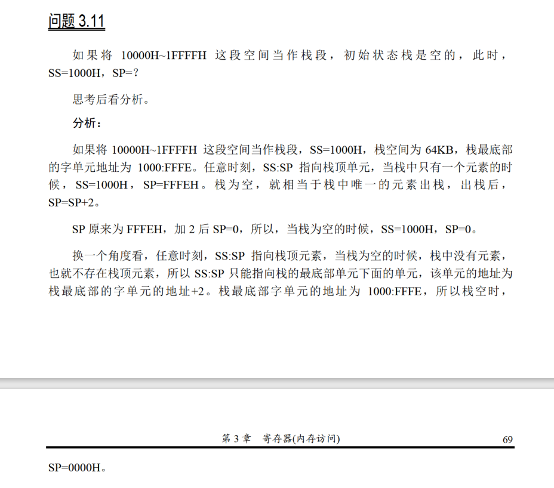
***
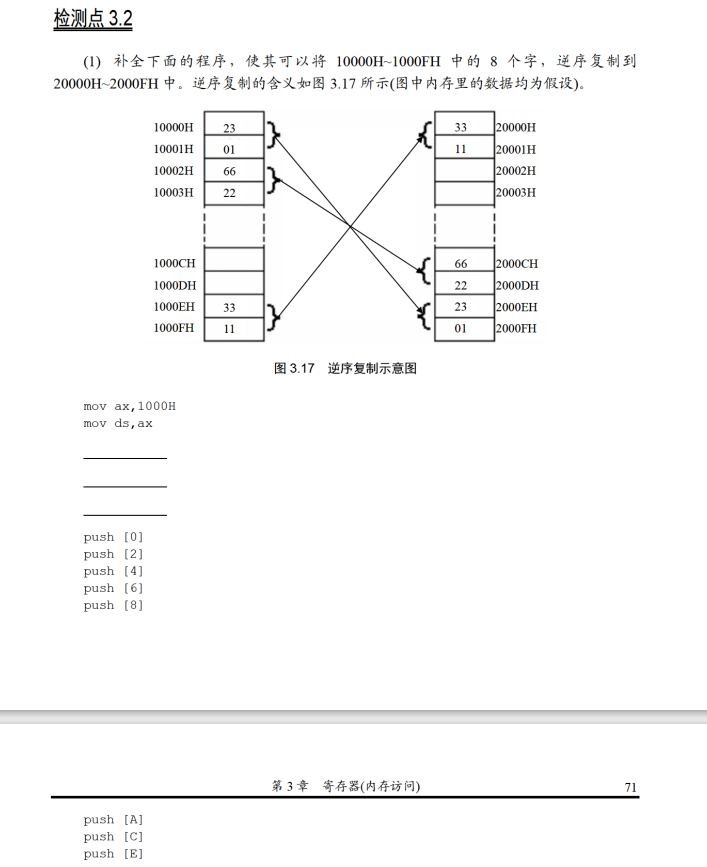
- mov ax,2000h
- mov ss,ax
- mov sp,0010h (0010h-0002h=000eh)
***
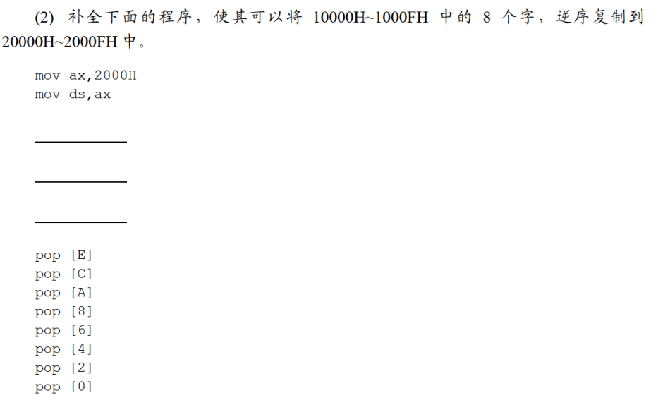

- mov ax , 1000h
- mov ss , ax
- mov sp , fffeh (fffeh+0002h=0000h)
***
[实验2](../../../projects/assembly/assembly_language/expr_2/)

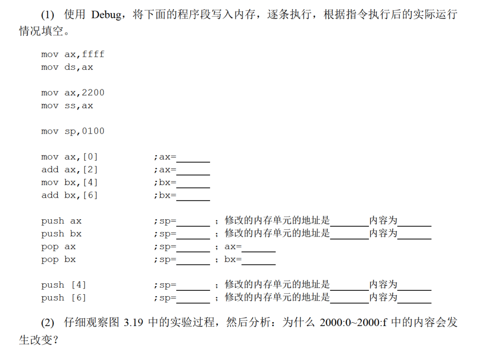
```
- ax=00f4h
- ax=00f4h
- bx=3000h
- bx=5f31h
- sp=0062h 地址为0898:0062 ,内容为00f4h
- sp=0060h 地址为0898:0060 ,内容为5f31h
- sp=0062h ax=5f31h
- sp=0064h bx=00f4h
- sp=0062h 地址为0898:0062 ,内容为3000
- sp=0060h 地址为0898:0060 ,内容为2f31
```
(2)个人猜测多半与寄存器有关


### 第四章 第一个程序

#### 4.1 一个源程序从写出到执行的过程

简单介绍了编写->编译->链接->执行的过程  
编译产生目标文件(obj),链接产生可执行文件(exe)

#### 4.2 源程序

源程序中包含两种指令，分别是汇编指令与伪指令。
伪指令-eg:
- xxx segment 和 xxx ends (end segment) 定义一个段
- end (汇编程序的结束标记)
- assume (将段寄存器与某一个具体的段相联系)

源程序中的程序  
指源程序中最终由计算机执行并处理的指令和数据

标号
如 xxx segment中的 xxx

程序的结构

assume  
xxx segment  
代码  
xxx ends  
end  

程序返回
mov ax,4c00h
int 21h

#### 4.3 编辑源程序
没啥好说的，就是edit模式(c:\>edit)

#### 4.4 编译

用masm编译asm文件生成obj目标文件  
过程中忽略列表文件和交叉引用文件(.lst,.crf)

#### 4.5 链接
使用linker链接目标文件，从而生成可执行文件

#### 4.6 以简化方式..&4.7 exe的执行&4.8
没什么好说的


解答
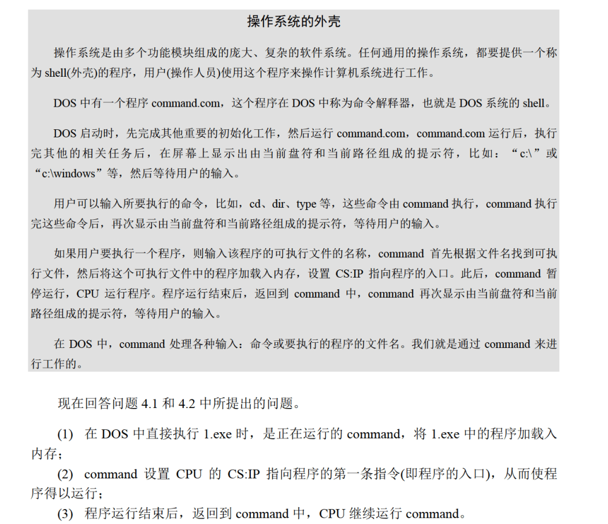

***

我们可知汇编程序从写出到执行的大概过程:

- 编程edit
- asm文件
- 编译(masm)
- obj目标文件
- 链接link
- exe可执行文件
- 加载(command)
- 内存中的程序
- 运行(cpu)

#### 4.9 程序执行过程的跟踪

其实就是debug  
debug主要是不放弃对cpu的控制，故而我们能够单步执行程序  
下面是dos系统中exe文件的加载过程:

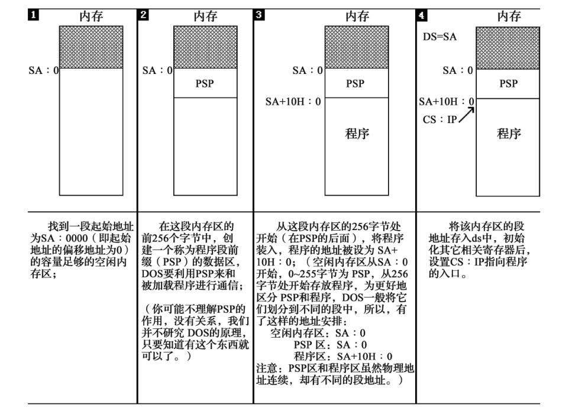

故从ds中可以得到psp的段地址

[实验3](../../../projects/assembly/assembly_language/expr_3/)

***
(2)
```
- ax=2000 bx=0000 (mov ax,2000h)
- ax=2000 bx=0000
- ax=2000 bx=0000
- ax=2000 bx=0000
- ax=0000 bx=0000
- ax=0000 bx=0000 (pop bx)
- ax=0000 bx=0000 sp:ss=0000
- ax=0000 bx=0000 sp:ss=0000
- ax=0000 bx=0000
- ax=0000 bx=0000 (pop bx)
```

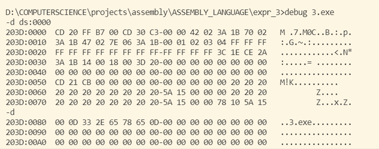

### 第五章 [bx]和loop指令

#### 约定：
- [bx]代表将偏移地址放在bx中，段地址默认在ds中
- loop 循环
- (ax)表示在ax中的内容，适用于内存单元，寄存器与段寄存器
- 约定符号idata表示常量

#### 5.1 [bx]
bx中存放的数据作为偏移地址  

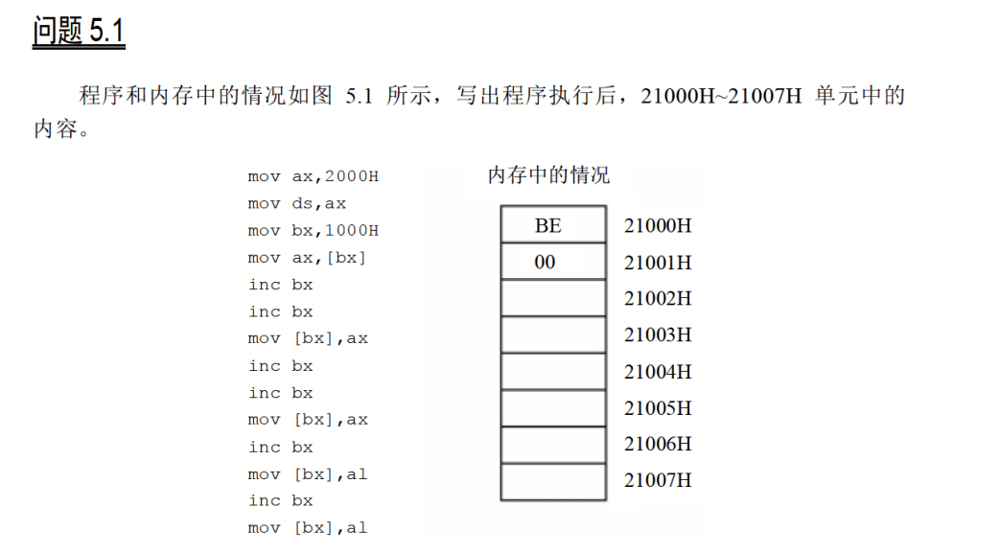
```
- 21000h be
- 21001h 00
- 21002h be
- 21003h 00
- 21004h be
- 21005h be
- 21006h be
- 21007h null
```
#### 5.2 loop指令

我们通常用loop指令实现循环功能，cx中存放着循环次数  
通过标号(例如：loop s1)来进行相应的循环跳转  

quiz 5.2:利用加法计算123*236，结果存放在ax中
***
```
 assume cs:code  
 code segment  
    mov cx,236  
    mov ax,0  
    mov dx,123  
  s:add ax,dx  
    loop s  
    mov ax,4c00h  
    int 21h  
 code ends  
 end  
```

quiz 5.3 改进5.2的计算速度
循环次数改进为123次，计算时加236即可

#### 5.3 debug跟踪loop
汇编源程序中。数据不可以字母开头  
故而ffffh会写为0ffffh  
跳过循环可使用debug中的g命令  

#### 5.4 debug和masm对指令的不同处理

对于形如 mov ax,[idata]的指令:

- debug会将[idata]默认为内存单元
- 但masm会将[idata]解释为立即数idata
- 若想将其解释为内存单元，则有:
- 1.显式给出段寄存器，如 mov ax,ds:[idata]
- 2.在[]中使用寄存器，如 mov ax,[bx],默认段寄存器为ds

#### 5.5 loop与[bx]的共同使用

直接看例子:


注:5.4是一个没有用循环的，很长的累加程序,计算ffff:0~到ffff:b单元中数据的和
***
```    
assume cs:code      
code segment       
    mov ax,0ffffh     
    mov ds,ax    
    mov bx,0     
    mov cx,12   
    mov dx,0    
  s:add dx,[bx]  (这步写错了,[bx]的内容只有8位，不能直接累加)   
    inc bx       (add dx,[bx]应改为 mov al,[bx] mov ah,0 add dx, ax)
    loop s      
    mov ax,4c00h    
    int 21h     
code ends       
end  
```

#### 5.6 段前缀

在访问内存单元时，用于显示地指明内存单元的段地址的(ds:,cs:,ed:,ss:)在汇编语言中被称为段前缀

#### 5.7 一段安全的内存空间

- 我们向内存写入内容时，这段内存不应该有其他程序的数据或代码，否则会应发错误与问题
- dos方式下，一般情况，0:200~0:2ff 空间中没有系统或其他程序的数据与代码，故用这段比较好

#### 5.8 段前缀的使用

使用ds和es作为段前缀在循环中使用...,比较简单

[实验4](../../../projects/assembly/assembly_language/expr_4/)

### 第六章 包含多个段的程序

前言： 
对于需求空间较大的程序，我们就不能只使用0:0200~0:02ff的安全空间了  
在这本汇编书中，只讨论加载程序时为程序分配空间的方法  
我们通过在源程序中定义段来进行内存空间的获取  

我们会以这样的顺序讨论多个段的问题： 
- 在一个段中存放数据，代码和栈，先体会一下不使用多个段时的情况
- 将数据，代码和栈放入不同的段中

#### 6.1 在代码段中使用数据

对于不存放在连续的内存单元里面，外界所给出的数据，在我们操作前，最好将这些数据储存在一组连续的内存单元中  

> 从规范的角度来说，我们是不能自己随便决定哪段空间可以使用的。故我们可以在程序中，定义我们希望处理的数据。这些数据会被编译，链接程序作为程序的一部分写入到可执行文件中。当可执行文件中的程序被加载入内存时，这些数据也自然被加载入内存中。故我们所要处理的数据也自然获得了存储空间
```
assume cs:code 

code segment 

	dw 0123h,0456h,0789h,0abch,0defh,0fedh,0cbah,0987h 

	start:	mov bx, 0  ;标号start
			mov ax, 0  
			
			mov cx, 8
	s:		add ax, cs:[bx]
			add bx, 2
			loop s 
			
			mov ax, 4c00h 
			int 21h 
code ends
end start
```

在实例程序中，我们直接在程序中用dw(定义字数据)定义了数据，并直接使用
```
assume cs:code
与
cs:xxxx
来定位数据的地址
```
但由于dw定义在前，故我们要直接指定cs:ip中的ip来跳过他们从而直接执行程序，直接是可执行程序是可能会出问题，因为程序入口不是我们所希望的指令，故而我们要使用标号***start***

在end后面加上start,可以使end通知编译器程序的入口在什么地方  

事实上，我们是通过可执行文件中的描述信息所指明的程序入口来设置第一条执行的命令的。   
我们知道可执行文件是由描述信息与程序所组成  
- 程序由源程序中的汇编指令和定义的数据所组成
- 描述信息则主要由编译，链接程序对源程序中相关伪指令做处理所得到的信息 

当程序被加载入内存后，加载者从程序的可执行程序中的描述信息中读到程序的入口地址，从而设置cs:ip

#### 6.2 在代码段中使用栈

就是用dw定义一段值为0的地址，通过cs确定ss,从而通过ss和sp作为栈来进行处理

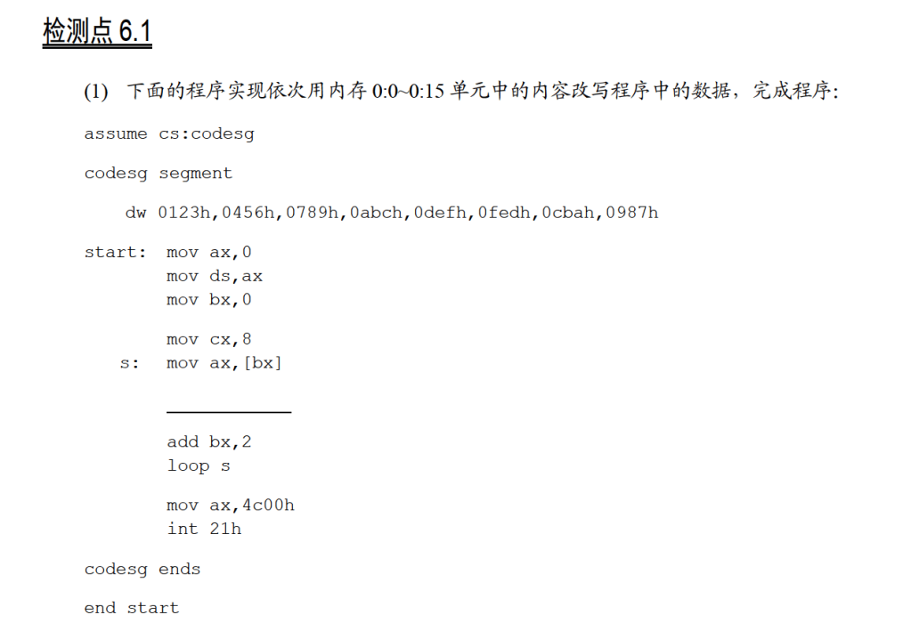

```
mov cs:[bx],ax
```
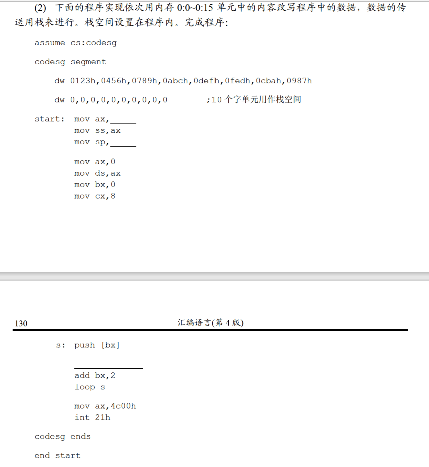

```
mov ax,cs
mov ss,ax
mov sp,0024h

s: push [bx]
   pop  cs:[bx]
```
#### 6.3 将数据，代码，栈放入不同的段

就是在程序中定义多个段  
程序中对段名的引用,如mov ds,data中的data会被编译器处理为一个表示段地址的数值，从而引发错误(段寄存器不能直接传递数值)  

- 段名类似标号，并不具有直接意义，程序不会自动将他们(code,data,stack)当作程序，数据和栈
- assume (cs,ds,ss):(code,data,stack) 并不会让cpu自动将前者指向后者。它只会将我们定义的具有一定用途的段和相关的寄存器联系起来
- cpu到底如何处理我们定义的段中的内容，是当作指令还是当作栈空间完全是靠程序中具体的汇编指令和汇编指令对cs,ds,ss等寄存器的设置来决定的

[实验5](../../../projects/assembly/assembly_language/expr_5/)

###  第七章 更灵活的定位内存地址的方法

#### 7.1 and 和 or 指令
简单的介绍了按位与和按位或

#### 7.2 关于ascii码
简单地说，所谓ascii编码方案，就是一套规则，它约定了用什么样的信息来表示现实对象
显卡在处理文本信息的时候，是按照ASCII码的规则进行的(将其写入显存)

#### 7.3 以字符形式给出的数据

在汇编中可以以'....'的形式指明数据是以字符形式给出的
eg: db'assembLY'

#### 7.4 大小写转换的问题
根据我们对ascii码的研究，大小写字母的ascii码值除了第5位外都是一样的  
大写字母第5位是0,小写的是1  

使用and 和 or 操作改变即可

#### 7.5&&7.6 [bx+idata]
[bx+idata]表示一个内存单元, 例如：mov ax, [bx+200]
用bx+idata的方式对字符串进行相应的类似数组的操作

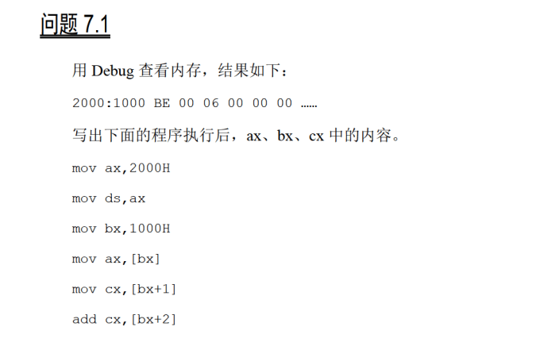
- ax=00beh
- bx=1000h
- cx=0606h

#### 7.7 si和di

si和di是8086CPU中和bx功能相近的寄存器，si和di不能够分成两个8位寄存器来使用。

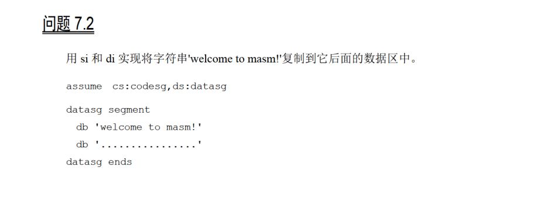
```
assume cs:codesg,ds:datasg

datasg segment
  db 'welcome to masm!'
  db '................'
datasg ends

codesg segment
  start:
        mov ax,datasg
        mov ds,ax
        mov sp,0
        mov si,16
    
        mov cx,8

      s:mov ax,[sp]
        mov [si],ax
        add si,2
        add sp,2
        loop s
      
        mov ax,4c00h
        int 21h
codesg ends
end start
```
quiz 7.3 用更少的代码实现7.2中的程序  
用bx进行迭代就行了

#### 7.8 [bx+si] 和 [bx+di]

[bx+si]表示一个内存单元，它的偏移地址为（bx）+（si）  
该指令也可以写成如下格式：mov ax, [bx][si]  
段地址仍然在ds中  

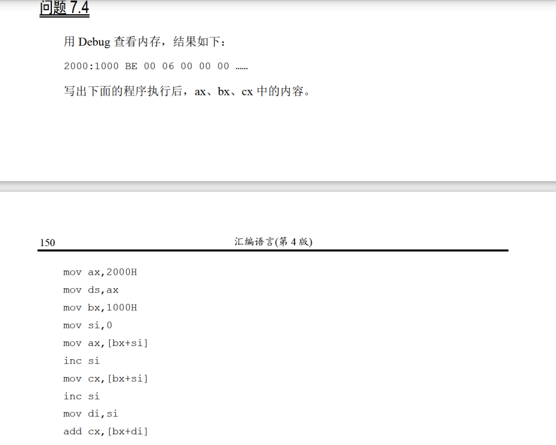

- ax=00beh
- bx=1000h
- cx=0606h

#### 7.9 [bx+si+idata]和[bx+di+idata]
[bx+si+idata]表示一个内存单元，它的偏移地址为（bx）+（si）+idata  
可以写成 200[bx][si] 或 [bx][si].200

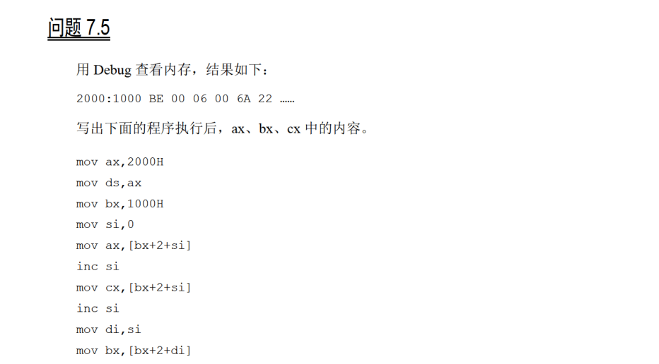

- ax=0006h
- bx=6a00h
- cx=226ah
#### 7.10 不同的寻址方式的灵活应用  
```
[idata]用一个常量来表示地址，可用于直接定位一个内存单元；  
[bx]用一个变量来表示内存地址，可用于间接定位一个内存单元；  
[bx+idata]用一个变量和常量表示地址，可在一个起始地址的基础上用变量间接定位一个内存单元；  
[bx+si]用两个变量表示地址；  
[bx+si+idata]用两个变量和一个常量表示地址。  
```

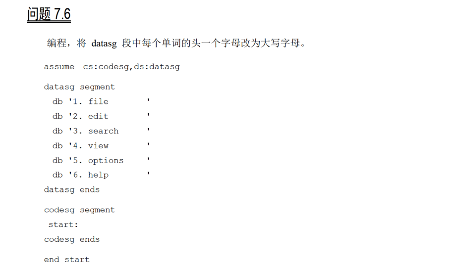

```
assume cs:codesg,ds:datasg

datasg segment
  db '1. file   ';16个字节长
  ...
datasg ends

codesg segment
  start:
      mov ax,datasg
      mov ds,ax
      mov bx,0000h
      mov cx,6

    s:
      mov al,[bx+3]
      and al,11011111b
      mov [bx+3],al
      add bx,0010h
      loop s

      mov ax,4c00h
      int 21h
codesg ends
end start
```
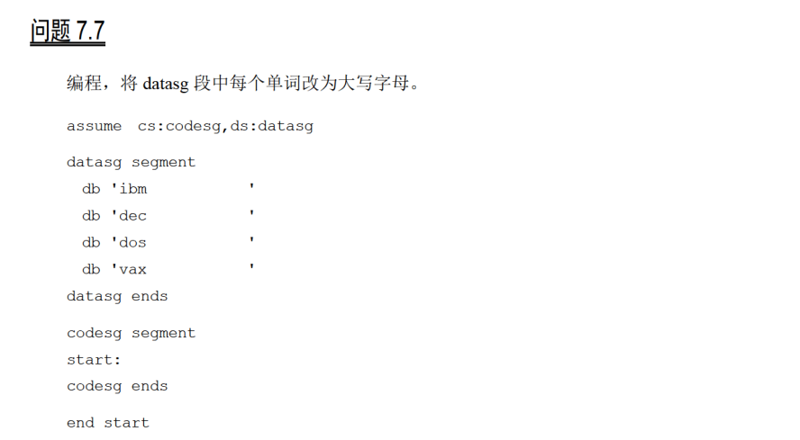

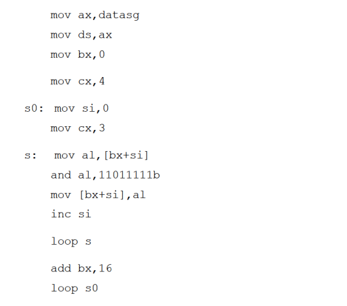

quiz7.8 看给出的程序，有什么问题？   
A: 只用了一个循环控制器

改进版:
```
assume cs:codesg,ds:datasg

datasg segment
  db 'ibm       ';16个字节长
  ...
datasg ends

codesg segment
  start:
      mov ax,datasg
      mov ds,ax
      mov bx,0000h
      mov cx,4
    s0:
      mov ds:[40h],cx
      mov si,0
      mov cx,3

    s:
      mov al,[bx+si]   ;si控制一维数组的index
      and al,11011111b
      mov [bx+si],al
      inc si
      loop s

      add bx,0010h     ;bx控制外层的顺序
      mov cx,ds:[40h]
      loop s0


      mov ax,4c00h
      int 21h
codesg ends
end start
```
暂存数据的时候还是用栈好  
写程序的时候定义一个栈段就好了

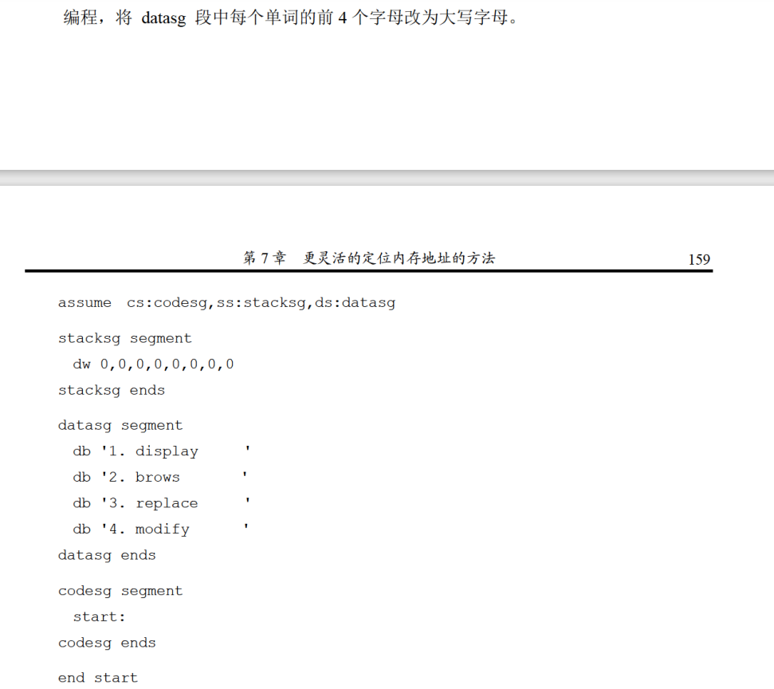

```

stacksg segment
  dw 0,0,0,0,0,0,0,0
stacksg ends

datasg segment
  db '1. display     ' ; 16位
  .....
datasg ends

codesg segment
  start:
      mov ax,datasg
      mov ds,ax
      mov bx,0000h

      mov ax,stacksg
      mov ss,ax
      mov sp,0010h

      mov ax,0
      mov cx,4

    s0:
      push cx
      mov si,3
      mov cx,4
    s1:
      mov al,ds:[bx+si]
      and al,11011111b
      mov ds:[bx+si],al
      inc si
      loop s1

      add bx,0010h
      pop cx

      loop s0
codesg ends

end start
```
[实验6](../../../projects/assembly/assembly_language/expr_6/)

### 第八章 数据处理的两个基本问题

前言: 
- 约定reg代表一个寄存器(ax,bx,al,bl,si,di,etc)
- 约定sreg代表一个段寄存器

#### 8.1 bx,si,di和bp

- 8086cpu中，只有这4个寄存器可以用在[..]中来进行内存单元的寻址  
- 在[..]中，这4个寄存器可以单独出现，或者只能以这4种组合出现:bx-si,bx-di,bp-si,bp-di
- 只要在[..]中使用段寄存器bp,而指令中没有显性地给出段地址，则默认段地址在ss中

#### 8.2 机器指令处理的数据在什么地方

- 处理大致可分为3类：读取，写入，运算
- 在机器指令这一层，我们并不关心数据的值，而是关心数据存放的位置
- 指令在执行前，所要处理的数据可以放在3个地方:cpu内部，内存，端口  

#### 8.3 汇编语言中数据位置表达

汇编语言中用3个概念来表达数据的位置
- 立即数，在汇编指令中直接给出直接包含在机器指令中的数据，
- eg:mov ax,1
- 寄存器，指令要处理的数据在寄存器
- eg:mov ax,bx
- 段地址(sa)与偏移地址(ea)
- eg:mov ax,ds:[bx+si+8]

#### 8.4 寻址方式

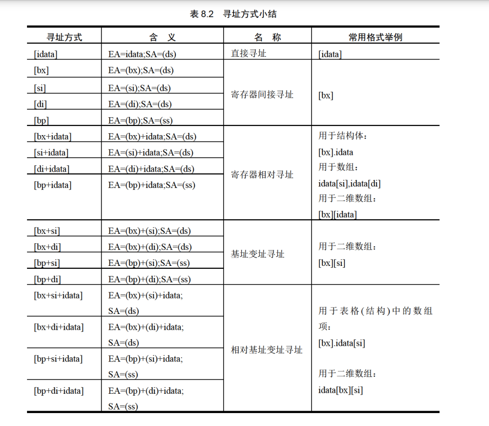

#### 8.5 指令要处理的数据有多长  

8086CPU的指令，可以处理两种尺寸的数据，byte和word
在机器指令中指明指令进行的是字操作还是字节操作有以下几种方法
- 通过寄存器名指明要处理的数据的尺寸。  
例如： mov al, ds:[0] 寄存器al指明了数据为1字节

- 在没有寄存器名存在的情况下，用操作符X ptr指明内存单元的长度，X在汇编指令中可以为word或byte。  
例如：mov byte ptr ds:[0], 1   
byte ptr 指明了指令访问的内存单元是一个字节单元

- 有些指令默认了访问的是字单元还是字节单元  
例如，push [1000H]，push 指令只进行字操作。

#### 8.6 寻址方式的综合应用
一个实例，展示对不同寻址方式的应用
主要展示用bx定位结构体，用idata定位结构体中的某一个数据项，用si定位数组项中的每个元素
#### 8.7 div指令

div是除法指令

除数：有8位和16位两种，在一个寄存器或内存单元中

被除数：默认放在AX或(dx,ax)中
如果除数为8位，被除数则为16位，默认在AX中存放
如果除数为16位，被除数则为32位，在DX和AX中存放，DX存放高16位，AX存放低16位

结果：
如果除数为8位，则AL存储除法操作的商，AH存储除法操作的余数
如果除数为16位，则AX存储除法操作的商，DX存储除法操作的余数

#### 8.8 伪指令dd
db和dw定义字节型数据和字型数据。

dd是用来定义dword（double word，双字）型数据的伪指令

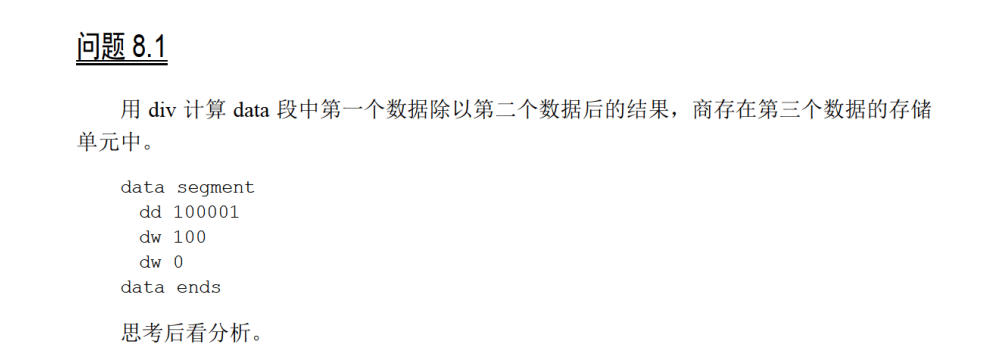

```
data segment
  dd 100001
  dw 100
  dw 0
data ends

code segment
  mov ax,data
  mov ds,ax
  mov dx,ds:[2]
  mov ax,ds:[0]
  div word ptr ds:[4](注意ptr指定大小)
  mov ds:[6],ax
code ends
```

#### 8.9 dup
dup在汇编语言中同db、dw、dd等一样，也是由编译器识别处理的符号  
它和db、dw、dd等数据定义伪指令配合使用，用来进行数据的重复

- db 3 dup(0) 相当于db 0,0,0
- db 3 dup(0,1,2) 相当于db 0,1,2,0,1,2,0,1,2
- db 2 dup('ac','AC') 相当与 db 'acACacAC'


[实验7](../../../projects/assembly/assembly_language/expr_7/)

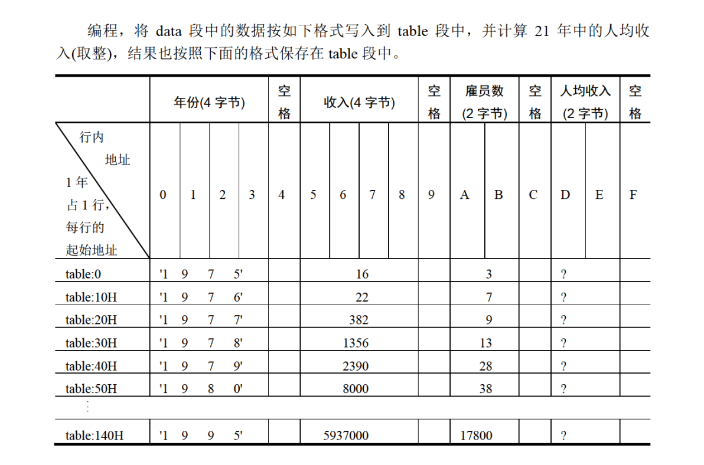

### 第九章 转移指令的原理

前言:  
***可以修改IP，或同时修改CS和IP的指令统称为转移指令***

8086CPU的转移行为有以下几类。

- 只修改IP时，称为段内转移，比如：jmp ax。
- 同时修改CS和IP时，称为段间转移，比如：jmp 1000:0。
由于转移指令对IP的修改范围不同，段内转移又分为：短转移和近转移。

- 短转移IP的修改范围为-128 ~ 127。
- 近转移IP的修改范围为-32768 ~ 32767。

8086CPU的转移指令分为以下几类。

- 无条件转移指令（如：jmp）
- 条件转移指令
- 循环指令（如：loop）
- 过程
- 中断

#### 9.1 操作符offset
操作符offset在汇编语言中是由编译器处理的符号，它的功能是取得标号的偏移地址

nop的机器码占一个字节
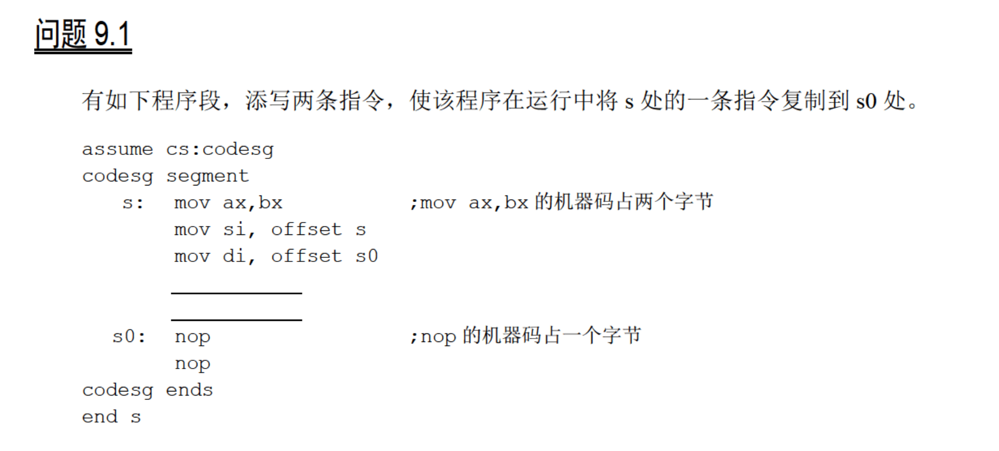
```
mov ax,cs:[si]
mov cs:[di],ax
```

#### 9.2 jmp指令
jmp为无条件转移，转到标号处执行指令可以只修改IP，也可以同时修改CS和IP

jmp指令要给出两种信息：

- 转移的目的地址
- 转移的距离(段间转移、段内短转移，段内近转移)

#### 9.3 依据位移进行转移的jmp指令


jmp short 标号（段内短转移）

指令“jmp short 标号”的功能为(IP)=(IP)+8位位移，转到标号处执行指令

- 8位位移 = “标号”处的地址 - jmp指令后的第一个字节的地址；

- short指明此处的位移为8位位移；

- 8位位移的范围为-128~127，用补码表示

- 8位位移由编译程序在编译时算出。

jmp short s指令的读取和执行过程：

- (CS)=0BBDH，(IP)=0006，上一条指令执行结束后CS:IP指向EB 03（jmp short s的机器码）；
- 读取指令码EB 03进入指令缓冲器；
- (IP) = (IP) + 所读取指令的长度 = (IP) + 2 = 0008，CS:IP指向add ax,1；
- CPU指行指令缓冲器中的指令EB 03；
- 指令EB 03执行后，(IP)=000BH，CS:IP指向inc ax  
  
CPU不需要目的地址就可以实现对IP的修改。这里是依据位移进行转移

jmp near 标号是进行16位转移的

#### 9.4 转移的目的地址在指令中的jmp指令
jmp far ptr 标号（段间转移或远转移）

指令 “jmp far ptr 标号” 功能如下：

- (CS) = 标号所在段的段地址；
- (IP) = 标号所在段中的偏移地址。
- far ptr指明了指令用标号的段地址和偏移地址修改CS和IP。

#### 9.5 转移地址在寄存器中的jmp指令
在2.11中已经讲过了(只改变ip,(ip)=(16位寄存器))

#### 9.6 转移地址在内存中的jmp指令

转移地址在内存中的jmp指令有两种格式：

- jmp word ptr 内存单元地址（段内转移）  
功能：从内存单元地址处开始存放着一个字，是转移的目的偏移地址

eg:
```
mov ax,0123h
mov [bx],ax
jmp word ptr [bx]
(ip)=0123h
```
- jmp dword ptr 内存单元地址（段间转移）
功能：从内存单元地址处开始存放着两个字，高地址处的字是转移的目的段地址，低地址处是转移的目的偏移地址。

(CS)=(内存单元地址+2)
(IP)=(内存单元地址)

eg:
```
mov ax,0123h
mov ds:[0],ax
mov word ptr ds:[2],0
jmp dword ptr ds:[0]
(cs)=0,(ip)=0123h
```


```
  dw 0,0
```

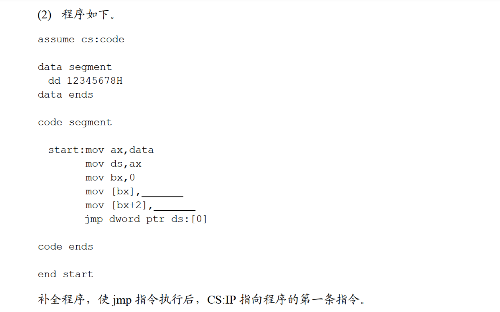
```
mov [bx],0000h
mov [bx+2],cs
```

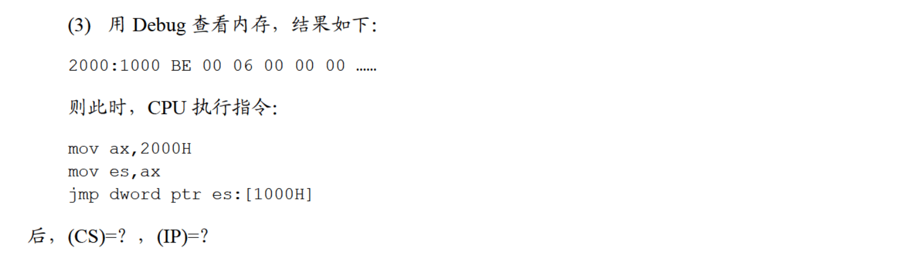
```
cs=0006h,ip=00beh
```

#### 9.7 jcxz指令
jcxz指令

jcxz指令为有条件转移指令，所有的有条件转移指令都是短转移，

在对应的机器码中包含转移的位移，而不是目的地址。对IP的修改范围都为-128~127

jcxz 标号 大致可以理解为if(cx==0) jmp short 标号

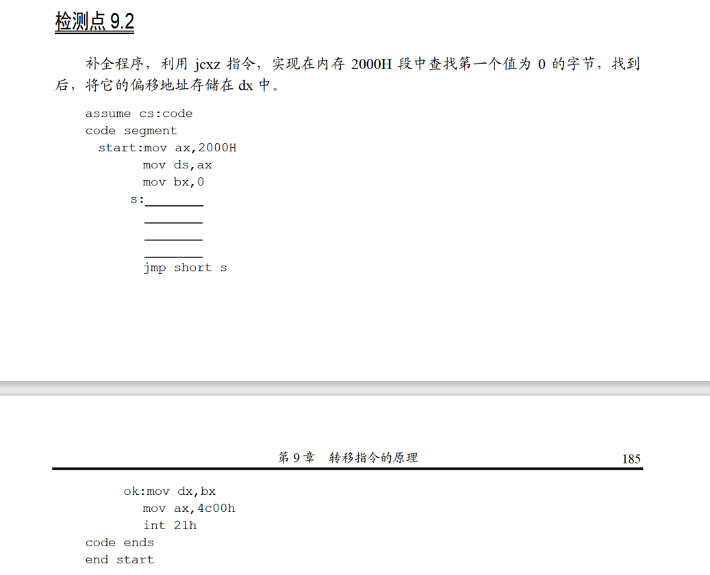
```
mov cl,ds:[bx]
mov ch,0
jcxz ok
inc bx
```
#### 9.8 loop指令

loop指令为循环指令，所有的循环指令都是短转移，在对应的机器码中包含转移的位移，而不是目的地址。

对IP的修改范围都为-128~127
loop 标号 类似于:
cx--
if(cx!=0) jmp short 标号

dec指令的功能与Inc相反(i=i-1)
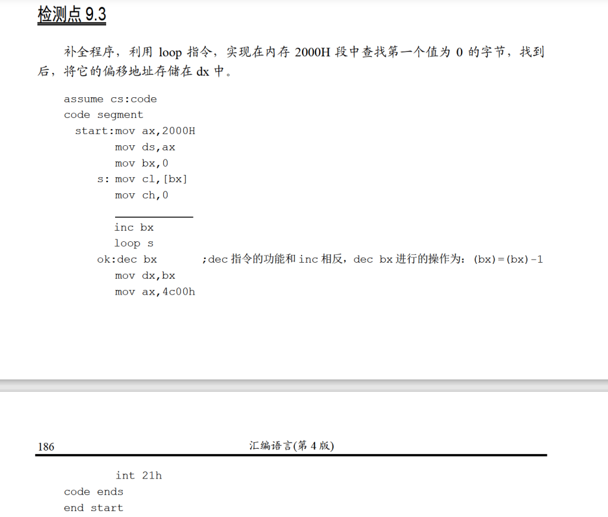

```
inc cx
```

#### 9.9 根据位移进行转移的意义

程序理论上是会装载在内存的不同位置的，如果类似loop s的s使用的不是标号而是s的地址，则就对程序段在内存中的偏移地址有了严格的限制。  
通过位移进行相对的转换就没有这些问题了

#### 9.10 编译器对转移位超界的检测

若转移范围超界(比如对于短位移超出了128个字节),编译器会在编译时给出警告

[实验8](../../../projects/assembly/assembly_language/expr_8/)

实验9的材料比较多，请去电子书处观看

[实验9](../../../projects/assembly/assembly_language/expr_9/)

### 第十章 call和ret指令

前言:
call 和 ret指令都是转移指令，他们都修改ip，或同时修改cs 和 ip  
他们经常被共同配套来实现子程序的设计  
#### 10.1 ret与retf

ret指令用栈中的数据，修改IP的内容，从而实现近转移

retf指令用栈中的数据，修改CS和IP的内容，从而实现远转移

CPU执行ret指令时，相当于进行：   
pop IP

CPU执行retf指令时，相当于进行：  
pop IP  
pop CS  

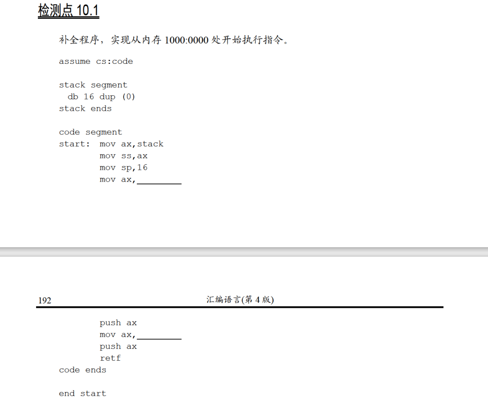

```
mov ax,1000h
mov ax,0000h
```

#### 10.2 call指令

call指令经常跟ret指令配合使用，因此CPU执行call指令，进行两步操作：

- 将当前的 IP 或 CS和IP 压入栈中
- 转移（jmp）。

call指令不能实现短转移(jmp short 标号)，除此之外，call指令实现转移的方法和 jmp 指令的原理相同

#### 10.3 根据位移进行转移的call指令

**call 标号**  
CPU执行此种格式的call指令时，相当于进行   
- push IP  
- jmp near ptr 标号

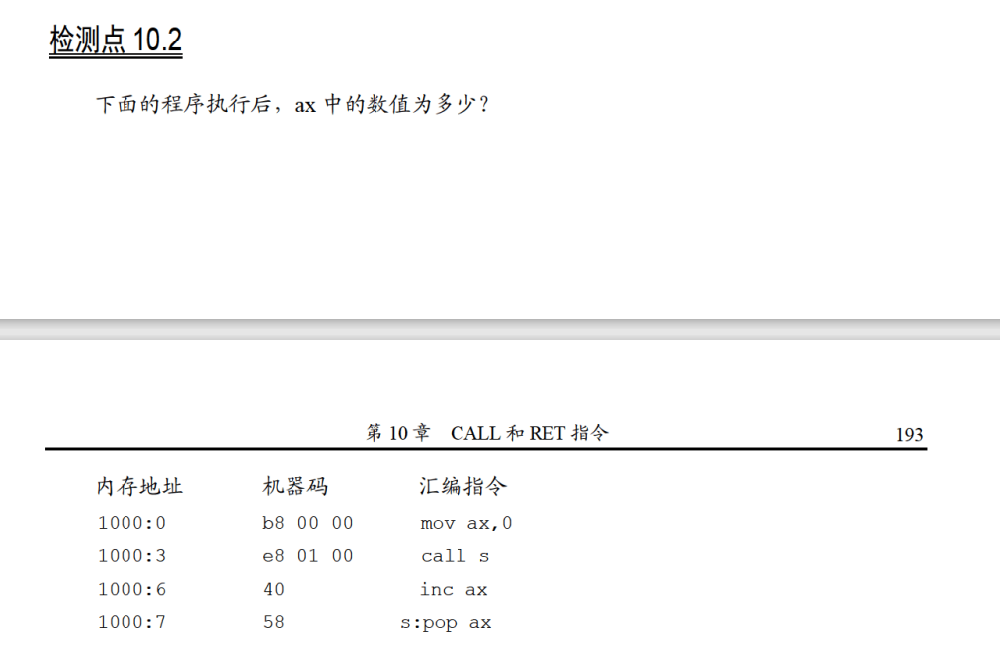

```
call s时push了ip
故而pop ax,ax的值为ip值
ax=0003h
```
#### 10.4 转移的目的地址在指令中的call指令

**call far ptr 标号（段间转移）**

CPU执行此种格式的call指令时，相当于进行：  
- push CS  
- push IP   
- jmp far ptr 标号  

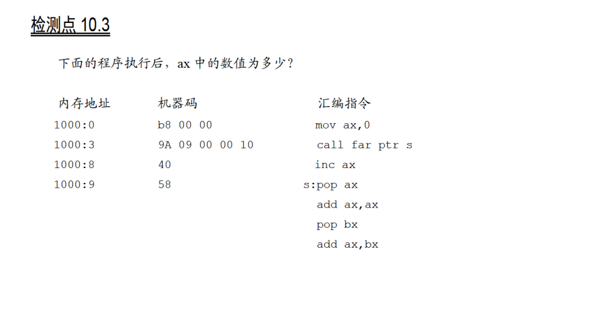
```
相当于将cs和ip相加
故值为1003h
```

#### 10.5 转移地址在寄存器中的call指令

**call 16位 reg**

CPU执行此种格式的call指令时，相当于进行  
- push IP 
- jmp 16位寄存器

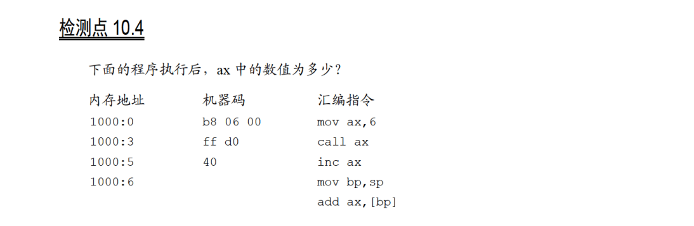

```
若我默认 add ax,[bp]其实是add ax,ss:[bp]
则 ax=9
```

#### 10.6 转移地址在内存中的call指令

分为两种:
**call word ptr 内存单元地址**

CPU执行此种格式的call指令时，相当于进行：
- push IP 
- jmp word ptr 内存单元地址


**call dword ptr 内存单元地址**

CPU执行此种格式的call指令时，相当于进行：  
- push CS 
- push IP 
- jmp dword ptr 内存单元地址


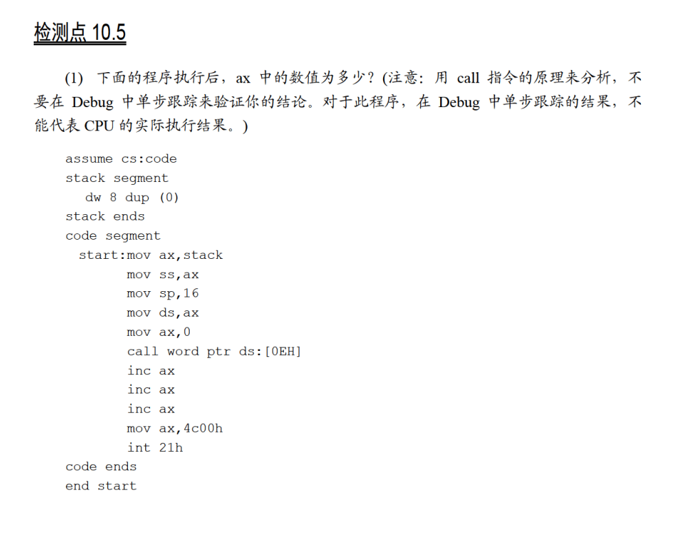

```
push ip,即执行指令时
ip已经指向啊一条指令，即inc ax
故最后 ax=3
```

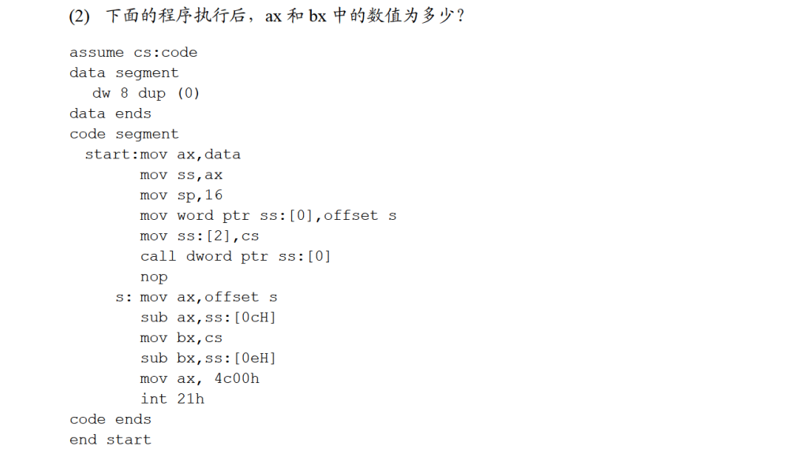

```
ax=1 （nop是一个字节)
bx=0
```
#### 10.7 call和ret的配合使用

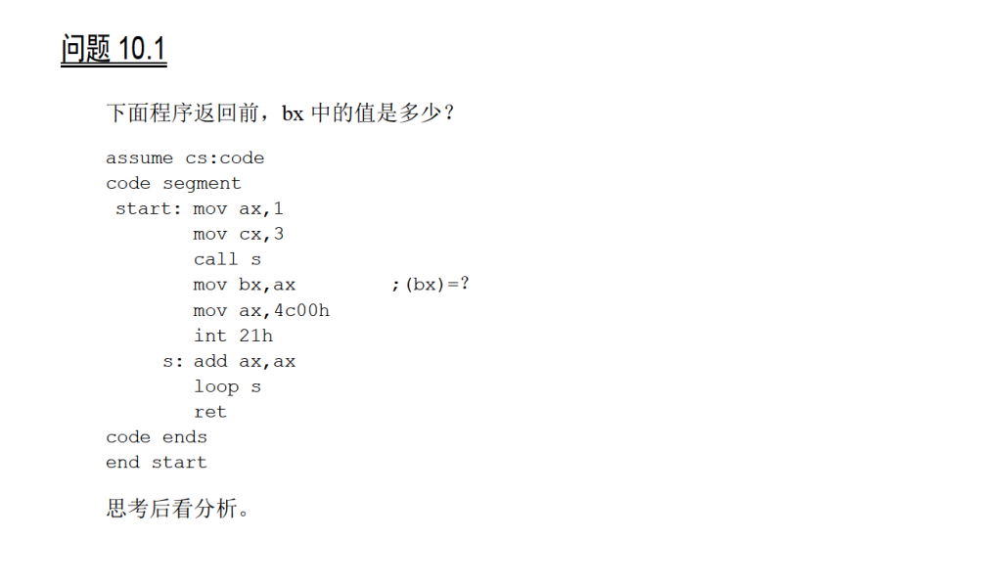

```
bx=8
```
还是比较简单的call-ret配合程序

通过在主要代码块外面编写子程序配合call-ret来达到类似函数的效果

#### 10.8 mul指令

**mul  (寄存器|内存单元)**

mul是乘法指令，使用 mul 做乘法的时候相乘的两个数,要么都是8位，要么都是16位。

8位: AL中和8位寄存器或内存字节单元中；
16位: AX中和16位寄存器或内存字单元中。

结果储存在:

8位：AX中
16位：DX（高位）和 AX（低位）中

#### 10.9 模块化程序设计

将方法抽象出去进行，类似函数抽离从而达成模块化设计

#### 10.10 参数和结果传递的问题
此章主要介绍了用寄存器存储参数和结果这一最常使用的方法

#### 10.11 批量传递的数据

通过将数据批量放入内存中从而批量传输并进行处理  
例如将参数储存在自己设置的段中并进行处理

#### 10.12 寄存器冲突的问题

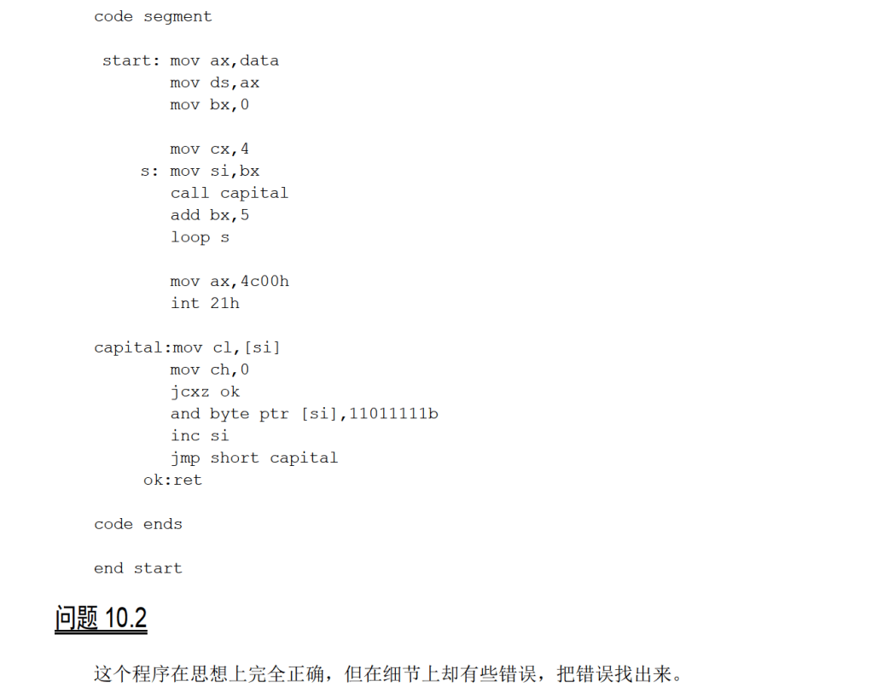

主要是在cx这个寄存器上发生了参数冲突的问题  
其会使主程序的循环次数出错  
其实可以使用栈进行相应的参数保护  
子程序使用的寄存器放入到栈里保护，出子程序时回复即可

[expr_10](../../../projects/assembly/assembly_language/expr_10/)
实验10资料较多，请去电子书上查看

[project1](../../../projects/assembly/assembly_language/project1/)

### 第十一章 标记寄存器
CPU内部的寄存器中，有一种特殊的寄存器（对于不同的处理机，个数和结构都可能不同）具有以下3种作用。

- 用来存储相关指令的某些执行结果
- 用来为CPU执行相关指令提供行为依据
- 用来控制CPU的相关工作方式

8086CPU的标志寄存器有16位，其中存储的信息通常被称为程序状态字（PSW-Program Status Word）

flag寄存器是按位起作用的，它的有些位有专门的含义，记录特定的信息


#### 11.1 zf标志
零标志位Zf(zero flag),他记录相关指令执行后，其结果是否为0  

- 若结果为0，则为zf=1(true)
- 若结果为1，则为zf=0(false)

在8086CPU的指令集中，有的指令的执行是影响标志寄存器的，比如，add、sub、mul、div、inc、or、and等，它们大都是运算指令（进行逻辑或算术运算）   

有的指令的执行对标志寄存器没有影响，比如，mov、push、pop等，它们大都是传送指令

#### 11.2 pf标志
奇偶标志位(parity flag),它记录相关指令执行后，其结果的所有bit位中1的个数是否为偶数
- 若1的个数为偶数，pf = 1
- 若1的个数为奇数，pf = 0

#### 11.3 sf标志
符号标志位(symbol flag),其记录相关指令执行后，其有符号数结果是否为负  
- 若为负数，sf=1
- 若为非负，则为sf=0

对于同一个二进制数据，计算机可以将它当作无符号数据来运算，也可以当作有符号数据来运算  

CPU在执行add等指令的时候，就包含了两种含义:可以将add指令进行的运算当作无符号数的运算，也可以将add指令进行的运算当作有符号数的运算  

SF标志，就是CPU对有符号数运算结果的一种记录，它记录数据的正负   
在我们将数据当作有符号数来运算的时候，可以通过它来得知有符号数运算结果的正负   
如果我们将数据当作无符号数来运算，SF的值则没有意义，虽然相关的指令影响了它的值  

 

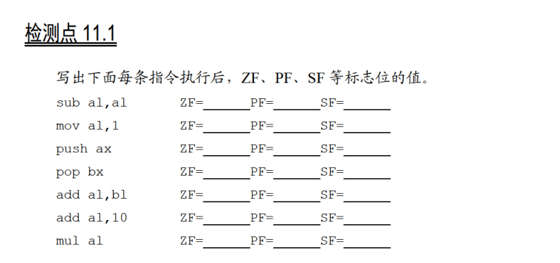

```
zf=1,pf=1,sf=0
zf=1,pf=1,sf=0
zf=1,pf=1,sf=0
zf=1,pf=1,sf=0
zf=0,pf=0,sf=0
zf=0,pf=1,sf=0
zf=0,pf=1,sf=1(144=128+16,首位是0)
```
#### 11.4 cf标志
进位标志位(carry flag),一般情况下，在进行无符号数运算的时候，它记录了运算结果的最高有效位向更高位的进位值，或从更高位的借位值  

数据相加进位1，cf=1  
数据相减借位1，cf=1

#### 11.5 of标志

在进行有符号运算时，若超过了机器所能表示的范围，则称之为溢出  
eg: mov al,99 add al,99   
其超过了-128~127的有符号数范围  

故有溢出标志位of(overflow flag),一般情况下，of记录了有符号数的运算结果是否发生了溢出  

- 若有溢出，则of=1
- 若没有溢出，则of=0
  
CF和OF的区别：CF是对无符号数运算有意义的标志位，而OF是对有符号数运算有意义的标志位  

CPU在执行add等指令的时候，就包含了两种含义：无符号数运算和有符号数运算    

对于无符号数运算，CPU用CF位来记录是否产生了进位  
对于有符号数运算，CPU用OF位来记录是否产生了溢出，当然，还要用SF位来记录结果的符号  
一般来说，正加正得负，负加负得正，肯定溢出
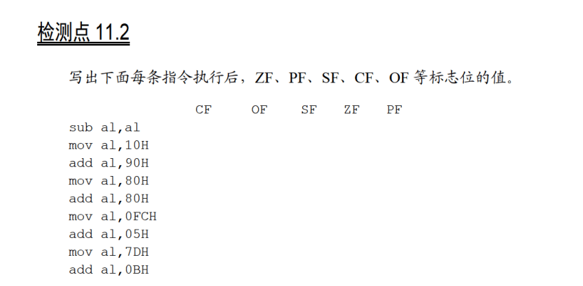

```
- cf=0,of=0,sf=0,zf=1,pf=1
- cf=0,of=0,sf=0,zf=1,pf=1
- cf=0,of=0,sf=0,zf=0,pf=1
- cf=0,of=0,sf=0,zf=0,pf=1
- cf=0,of=0,sf=0,zf=0,pf=0 (add al,80h)
- cf=0,of=0,sf=0,zf=0,pf=0
- cf=1,of=0,sf=0,zf=0,pf=0
- cf=1,of=0,sf=0,zf=0,pf=0
- cf=0,of=1,sf=1,zf=0,pf=1
```
#### 11.6 adc指令

adc是带进位加法指令，它利用了CF位上记录的进位值  

指令格式:adc 操作对象1, 操作对象2  

功能：操作对象1 = 操作对象1 + 操作对象2 + CF  

可以通过带进位的加法实现对多位数的加减(例如64位+64位的加减法)  
记得在adc加减之前进行cf的清零(sub ax,ax)  
**inc 和 loop 指令不影响标志位**
#### 11.7 sbb指令
sbb是带借位减法指令，它利用了CF位上记录的借位值  

指令格式：sbb 操作对象1, 操作对象2  

功能：操作对象1 = 操作对象1 - 操作对象2 - CF  
与adc相同，可以进行多位数加减法

#### 11.8 cmp指令

cmp是比较指令，cmp的功能相当于减法指令，只是不保存结果。cmp指令执行后，将对标志寄存器产生影响  

其他相关指令通过识别这些被影响的标志寄存器位来得知比较结果  
cmp指令格式：cmp 操作对象1，操作对象2  
其实就是只影响标志寄存器的sbb指令，只是不保存结果  

eg:
指令cmp ax, ax，做（ax）-（ax）的运算，结果为0，但并不在ax中保存，仅影响flag的相关各位。
指令执行后：zf=1，pf=1，sf=0，cf=0，of=0

cmp无符号数比较:
| cmp ax,bx | flag      |
| --------- | --------- |
| ax=bx     | zf=0      |
| ax!=bx    | zf=0      |
| ax<bx     | cf=1      |
| ax>=bx    | cf=0      |
| ax>bx     | cf=0&zf=0 |
| ax<=bx    | cf=1&zf=1 |

两者为充要条件  

cmp有符号数比较
| cmp ax,bx | flag                                     |
| --------- | ---------------------------------------- |
| sf=1,of=0 | ax<bx(无溢出,很正常)                     |
| sf=1,of=1 | ax>bx(溢出导致结果为负数,原结果必然为正) |
| sf=0,of=1 | ax<bx(溢出导致结果为正数,原结果必然为负) |
| sf=1,of=0 | ax>=bx(无溢出,结果非负)                  |

#### 11.9 检测比较结果的条件转移指令

除jcxz外，cpu还有其他的条件转移指令  
所有条件转移指令位移都是-128~127  

下面是常见的与cmp相配的条件转移指令  
| cmp ax,bx | flag      | meaning                 |
| --------- | --------- | ----------------------- |
| je  (=)   | zf=1      | 等于则转移(equal)       |
| jne (!=)  | zf=0      | 不等于则转移(not equal) |
| jb  (<)   | cf=1      | 低于则转移(below)       |
| jnb (>=)  | cf=0      | 不低于则转移(not below) |
| ja  (>)   | cf=0&zf=0 | 高于则转移(above)       |
| jna (<=)  | cf=1&zf=1 | 不高于则转移(not above) |

感觉类似某种互补关系。。

编码时最好直接将cmp与这些指令配合使用，不在意标志位，隐藏底层细节  

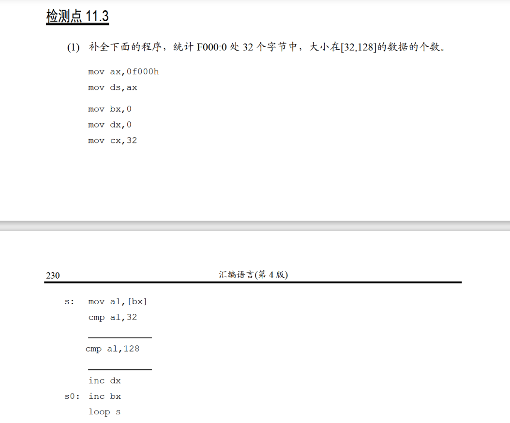

```
jb s0
ja s0
```
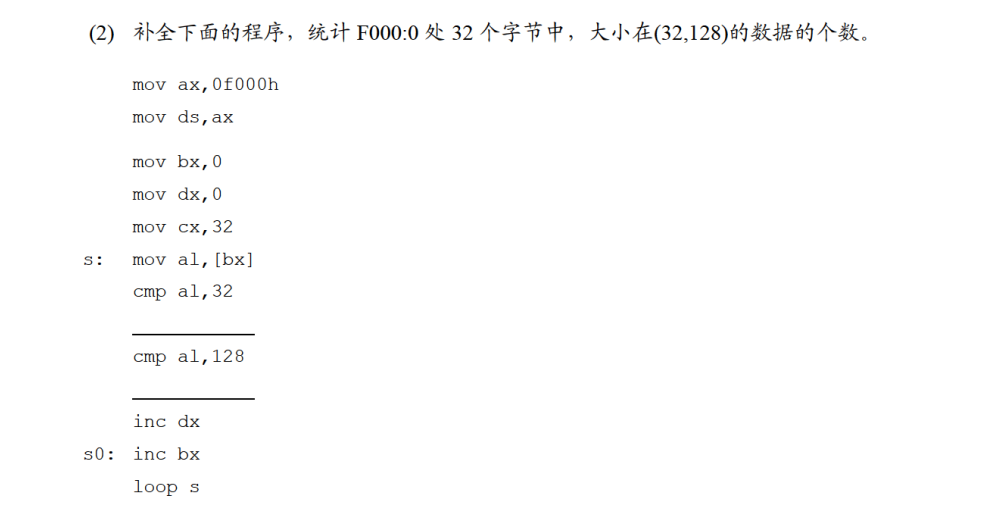

```
jna s0
jnb s0
```

#### 11.10 df标志和串传送指令

方向标志位。在串处理指令中，控制每次操作后si、di的增减。

- df = 0每次操作后si、di递增
- df = 1每次操作后si、di递减

串传送指令们:(主要功能是ds:[si]->es:[di])

格式：movsb
功能：将ds:si指向的内存单元中的字节送入es:di中，然后根据标志寄存器df位的值，将si和di递增或递减

格式：movsw
功能：将ds:si指向的内存字单元中的字送入es:di中，然后根据标志寄存器df位的值，将si和di递增2或递减2。

rep 可与其配合使用,类似(rep movsw)  
rep的作用是根据cx的值，重复执行后面的串传送指令  

8086CPU提供下面两条指令对df位进行设置。

- cld指令：将标志寄存器的df位置0(递减)
- std指令：将标志寄存器的df位置1(递增)

#### 11.11 pushf与popf


pushf的功能是将标志寄存器的值压栈，而popf是从栈中弹出数据，送入标志寄存器中  
pushf和popf，为直接访问标志寄存器提供了一种方法  (或许可以通过这个方法直接影响flag?)  

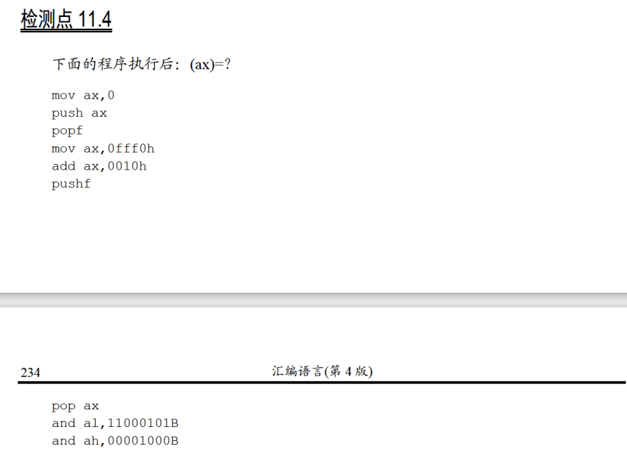

```
mov ax,0
push ax
popf(flag置零)

mov ax,0fff0h
add ax,0010h
pushf
pop ax(flag)(zf=1,cf=1,sf=0,pf=1,df=0,of=0)
and al,11000101b
and ah,00001000b
ax=0000 0000 0100 0101 b
```


#### 11.12 标志寄存器在debug中的表示

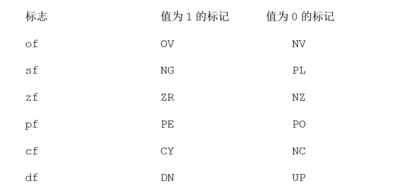

[expr_11](../../../projects/assembly/assembly_language/expr_11/)


### 第十二章 内中断

前言:  
任何一个通用的CPU，都具备一种能力，可以在执行完当前正在执行的指令之后，检测到从CPU外部发送过来的或内部产生的一种特殊信息，并且可以立即对所接收到的信息进行处理。  
这种特殊的信息，我们可以称其为：中断信息。中断的意思是指，CPU不再接着（刚执行完的指令）向下执行，而是转去处理这个特殊信息。

中断信息可以来自CPU的内部和外部（内中断，外中断）  
#### 12.1 内中断的产生
8086CPU的内中断（下面四种情况将产生中断信息）

- 除法错误，比如，执行div指令产生的除法溢出
- 单步执行
- 执行 into指令
- 执行 int指令

cpu需要知道所接受的中断信息的来源，所以中断信息中必须包含识别来源的编码  

中断信息中包含中断类型码，中断类型码为一个字节型数据，可以表示256种中断信息的来源（中断源）

上述的4种中断源，在8086CPU中的中断类型码如下。

- 除法错误：0
- 单步执行：1
- 执行into指令：4
- 执行int指令，该指令的格式为int n，指令中的n为字节型立即数，是提供给CPU的中断类型码。


#### 12.2 中断处理程序


用来处理中断信息的程序被称为中断处理程序

根据CPU的设计，中断类型码的作用就是用来定位中断处理程序。比如CPU根据中断类型码4，就可以找到4号中断的处理程序  

若要定位中断程序，则需要知道其的段地址以及偏移地址  
如何根据8位的中断类型码得到程序的段地址和偏移地址(程序入口)?

#### 12.3 中断向量表 

中断向量就是中断处理程序的入口地址  
中断向量表就是中断处理程序入口地址的列表  
CPU用8位的中断类型码通过中断向量表找到相应的中断处理程序的入口地址  
cpu只要知道了中断类型码，就可以将中断类型码作为中断向量表的表象号，定位，从而得到中断处理程序的入口地址  

对于8086pc机，中断向量表指定放在内存地址0处   
从0000:0000~0000:03ff的1024个单元中存放着中断向量表  

一个表项存放一个中断向量，占两个字，高地址存放段地址，低地址字存放偏移地址  

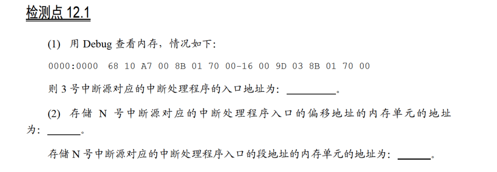

```
(1) 039d:0016
(2) 0000:0000+2*n
    0000:0000+2*n+1
```

#### 12.4 中断过程

中断过程中，cpu中断类型码找到中断向量，并用它设置cs和ip.  

下面是8086cpu收到中断信息后所引发的中断过程  
- 取得中断类型码N
- pushf,标志寄存器入栈
- TF=0，IF=0(后面解使) 
- push CS 
- push IP
- (IP)=(N * 4)，(CS)=(N * 4 + 2) (从内存地址为中断类型码*4和*4+2的两个字单元中读取中断处理程序的入口地址设置cs和ip)

中断过程主要就是设置cs:ip地址以执行中断程序  
硬件在完成中断过程后，CS:IP将指向中断处理程序的入口，CPU开始执行中断处理程序  

#### 12.5 中断处理程序和iret指令  

中断处理程序要注意的地方和子程序比较相似:  
- 保存要用到的寄存器
- 处理中断
- 恢复要用到的寄存器
- 用ret指令返回  
  
iret指令的功能用汇编语法描述为:

- pop ip  
- pop cs  
- popf

cpu回到执行中断处理程序之前的执行点继续执行程序  

#### 12.6 除法错误中断的处理  

0号中断，即除法溢出错误中断的处理  
会显示提示信息"divide overflow"  

#### 12.7 编程处理0号中断  

我们会重新编写一个0号中断，其的功能是在屏幕中间显示"overflow!"

#### 12.8


